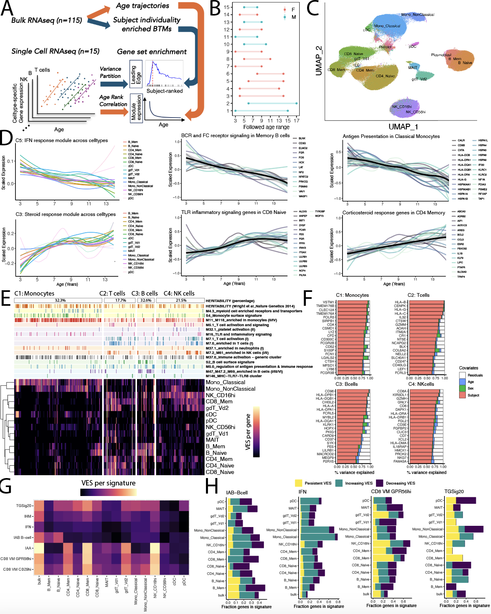

# Nicaragua_SingleCell
This repository contains notebooks to reproduce the single cell analysis of the Nicaragua project - revealing baseline immune signatures in blood transcriptomes of children.



## Data Availability

Processed data files to reproduce the analysis are available on zenodo under: \
Longitudinal blood transcriptomic profiling of Nicaraguan children reveals trajectories of pediatric immune development and individuality \
https://zenodo.org/api/records/15151094

## Data Analysis Instructions for Reproducibility

Below are pointers to scripts to reproduce figures and respective pre-processing steps. Each analysis below the following captions can be reproduced independently based on provided intermediate results in the zenodo repository. Raw data processing can not be reproduced as we are unable to share this data, nevertheless we share the scripts how the analysis was carried out.

### Environment and Container
To reproduce the analysis conda environment can be created from one of the yml files in the environment folder or the following singularity container available on https://cloud.sylabs.io/ can be used: \
```library://leon.bichmann/nicaragua/nicaragua:latest```

In the case of choosing one of the provided conda environments, also install the local Rpackage ImmuneAgeStability: \
```install.packages("Nicaragua_SingleCell/ImmuneAgeStability", repos = NULL, type="source")``` \

### ImmuneAgeStability Rpackage
This Rpackage provides a way to reproduce some of the analysis carried out in our study as described in the scripts below. In addition it also enables users to assess any of their own gene expression signatures for aspects of temporal stabilty during childhood. 

### Snakemake workflow to reproduce all figures at once
If you are familiar with snakemake and simply want to recreate all figures in one step, just run the follwing: \
-> **GoTo:** figures_snakemake \
-> **Data:** download all data from the zenodo repository into figures_sakemake/data/input/ \
-> **Execution:**  ```snakemake --use-singularity```

## Details on pre-processing and figure notebooks

### Snakemake workflow to reproduce all preprocessing steps at once
If you are familiar with snakemake and simply want to recreate all figures in one step, just run the follwing: \
-> **GoTo:** preprocess_snakemake \
-> **Data:** download all data from the zenodo repository into preprocess_sakemake/data/input/ \
-> **Execution:**  ```snakemake --use-singularity```

### Pre-processing: Pseudobulk Generation from Single Cell Data
-> **Data:** Download single cell RDS object from Zenodo: "NICAall_combined_manual_labeled_cleaned_final.rds" \
-> **Code to run:** pseudobulk_processing/export_pseudobulk.R

### Pre-processing: Pseudobulk Normalization
-> **Data:** Download pseubulk RDS object from Zenodo: "NICA_batch2to4_new_timepoints_cleaned.rds" \
-> **Code to run:** pseudobulk_processing/normalize_and_batch_correct_pseudobulk.R

### Pre-processing: Age and Subject Variance Partitioning
-> **Data:** Download normalized pseudobulk RDS object from Zenodo: "NICA_batch2to4_new_timepoints_cleaned_normalized.rds" \
-> **Code to run:** pseudobulk_processing/fit_linear_models_pseudobulk.Rmd

### Pre-processing: Increasing and Decreasing Subject Individuality
-> **Data:** Download celltype divided pseudobulk RDS objects from Zenodo: "pseudobulk_per_celltype.zip" \
-> **Data:** Download singularity image from Zenodo: "intrinsicness_0.1.sif" \
-> **Prepare:** Extract celltype specific pseudobulk folder into incr_decr_variance/data/processed/ \
-> **Code to run:** incr_decr_variance/Snakefile \
-> **Example execution:** \
```snakemake -j 16 --configfile config.yaml --use-singularity --executor slurm```

### Pre-processing: Pseudobulk Generation in Adult Old Cohort (Terekhova et al, 2023)
-> **Data:** Download public data set from synapse.org (syn49637038): "all_pbmcs_rna_harmony.h5ad" \
-> **Data:** Download public data set from synapse.org (syn49637038): "pbmc_gex_raw_with_var_obs.h5ad" \
-> **Data:** Download bootstrapped donor list from Zenodo: "age_subject_variance_donors_adult_old_aging_cohort.RDS" \
-> **Code to run:** pseudobulk_processing/export_pseudobulk_adult_old.R

### Pre-processing: Pseudobulk Normalization of Adult Old Cohort (Terekhova et al, 2023)
-> **Data:** Download celltype divided pseudobulk RDS objects from Zenodo: "pseudobulk_aging_cohort.zip" \
-> **Prepare:** Extract celltype specific pseudobulk folder into /pseudobulk_aging_cohort \
-> **Code to run:** pseudobulk_processing/normalize_and_batch_correct_pseudobulk_adult_old.R

### Pre-processing: Subject Variance Partitioning of Adult Old Cohort (Terekhova et al, 2023)
-> **Data:** Download normalized pseudobulk RDS object from Zenodo: "all_adult_pbulk_list_normalized.rds" \
-> **Code to run:** pseudobulk_processing/fit_linear_models_pseudobulk_adult_old.R

### Figure 3B,C - Single Cell UMAP and Age Range of Individuals
-> **Data:** Download single cell RDS object from Zenodo: "NICAall_combined_manual_labeled_cleaned_final.rds" \
-> **Code to run:** downstream_analysis/Individuals_and_UMAP.Rmd

### Figure 3D - Age Trajectories
-> **Data:** Download bulk age trajectory gene sets from Zenodo: "supp_tables_S6.csv" \
-> **Data:** Download bulk subject variance gene sets from Zenodo: "supp_tables_S10.csv" \
-> **Data:** Download raw single cell variance partition results from Zenodo: "NICA_batch2to4_new_timepoints_cleaned_normalized_fsex_spline.rds" \
-> **Data:** Download aggregated single cell variance partition results from Zenodo: "NICA_batch2to4_new_timepoints_cleaned_normalized_fsex_vpars_object.rds" \
-> **Data:** Download normalized pseudobulk RDS object from Zenodo: "NICA_batch2to4_new_timepoints_cleaned_normalized.rds" \
-> **Data:** Download simplified age variance partition results: "/Users/leon/Documents/NICA/sc_analysis/data/NICA_batch2to4_new_timepoints_limma_fgsea_simplified_age_results.rds" \
-> **Code to run:** downstream_analysis/Age_trends_and_enrichments.Rmd

### Figure 3E,F,G,H - Variance Explained by Subject (VES) Heatmap and by Gene, Celltype and Signature
-> **Data:** Download bulk subject variance explicit per gene from Zenodo: "supp_tables_S9.csv" \
-> **Data:** Download bulk subject variance gene sets from Zenodo: "supp_tables_S10.csv" \
-> **Data:** Download raw single cell variance partition results from Zenodo: "NICA_batch2to4_new_timepoints_fsex_subject_enriched_with_labels.rds" \
-> **Data:** Download aggregated single cell variance partition results from Zenodo: "NICA_batch2to4_new_timepoints_cleaned_normalized_fsex_vpars_object.rds" \
-> **Data:** Download Highly Heritable Genes (Wright et al, 2014) from Zenodo: "inheritability_data_777.csv" \
-> **Data:** Download Heritability Pvalue per Gene (Wright et al, 2014) from Zenodo: "inheritability_data_pvals.csv" \
-> **Code to run:** downstream_analysis/VES_Heatmap.Rmd

### Figure 4A - VES correlation Adult, Old
-> **Data:** Download celltype-specific subject variance of aging cohort from zenodo: "age_subject_variance_VESlist_adult_old_aging_cohort_renorm.RDS" \
-> **Data:** Download ultra-stable gene list from zenodo: "age_subject_variance_ultrastab.RDS" \
-> **Data:** Download aggregated pediatric variance partition results from Zenodo: "NICA_batch2to4_new_timepoints_cleaned_normalized_fsex_vpars_object_renorm.rds" \
-> **Data:** Download aggregated pediatric and aging cohort variance partition results from Zenodo: "age_subject_variance_young_adult_old.RDS" \
-> **Code to run:** downstream_analysis/AdultOldCorrelations_new.Rmd


### Raw data processing: Cellranger, Normalization, Demuxlet
-> **Data:** Due to privacy concerns we did not make the raw data available \
-> **Data:** HTO mapping of timepoints: "HTO_matching_table_new_cleaned.xlsx" \
-> **Code to run:** Configurations how cellranger was run can be found here - singlecell_processing/example_cellranger.config \
-> **Code to run:** Example code how the cellranger output was normalized and annotated can be found here - singlecell_processing/sc_processing.R
